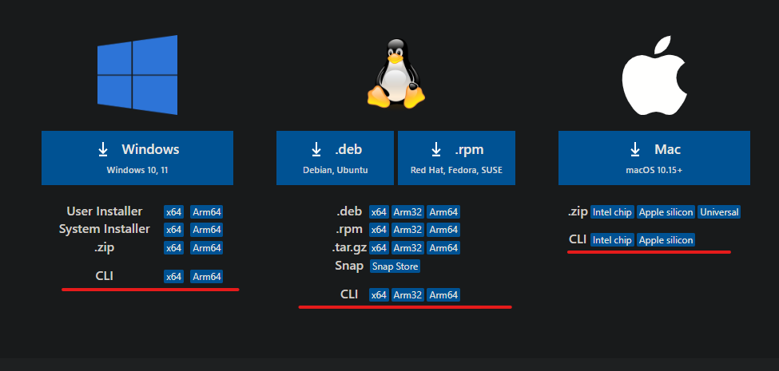

### VSCode Cli Nedir?

VSCode Cli, VSCode editörünün komut satırından çalışan aracıdır. Rust ile yazılmıştır ve açık kaynaklıdır.

VSC ile birlikte sisteme kurulabilmesiyle birlikte; kendi başına da kurulabilir. Bu eğitimde bu aracı inceleyeceğiz.

#### Kurulum
Aracı [bu linkten](https://code.visualstudio.com/#alt-downloads) indirebilirsiniz.
Web sayfasının en altında altını çizdiğim butonlardan sisteminize göre indirebilirsiniz. Burda CLI versiyonunu indirdiğinize dikkat ediniz.


Ayrıca eğer GUI(Grafik Arayüzü) erişiminiz yoksa alttaki kodu komut satırına yapıştırarak da yükleyebilirsiniz
```bash
# Bu adımda çalıştırılabilir dosyayı içeren sıkıştırılmış dosyayı indiriyoruz
curl -Lk 'https://code.visualstudio.com/sha/download?build=stable&os=cli-alpine-x64' --output vscode_cli.tar.gz
```
```bash
# Bu adımda bir önceki adımda indirdiğimiz sıkıştırılmış dosyanın içerisinden çalıştırılabilir dosyayı çıkarıyoruz
tar -xf vscode_cli.tar.gz
```

Aracı paket yöeneticiniz ile kurduysanız sonraki adımlarda 
```bash
code <parametreler>
```
curl kullanarak indirdiyseniz
```bash
./code <parametreler>
```
şeklinde kullanınız
