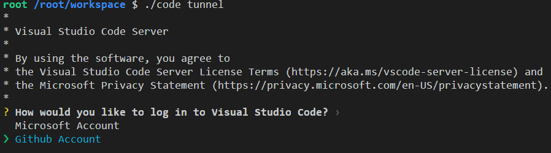
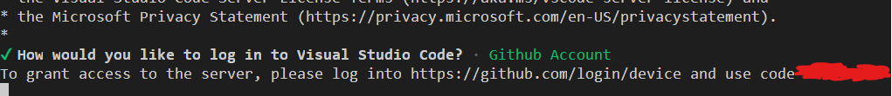
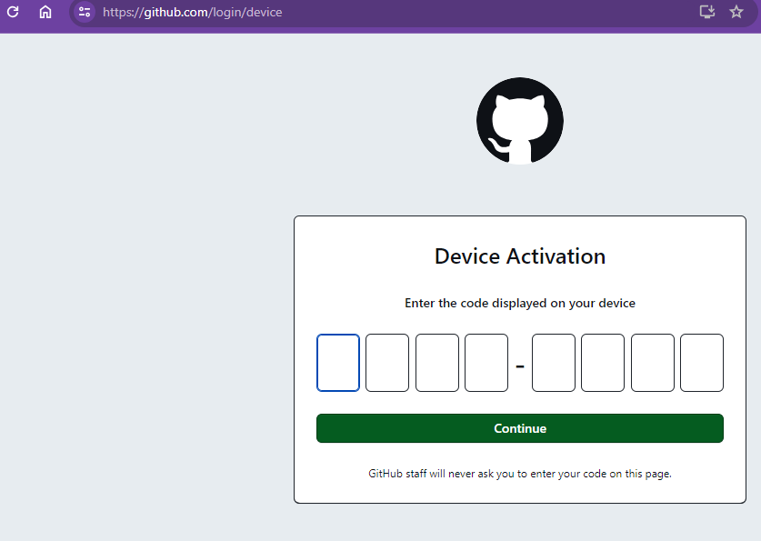
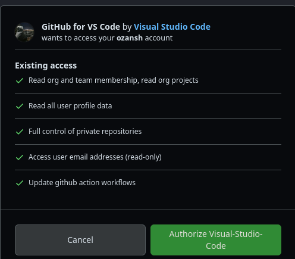
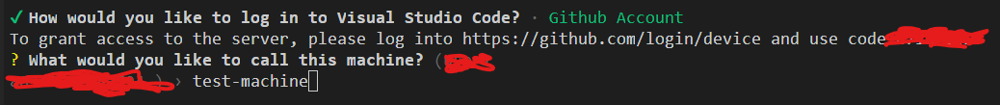
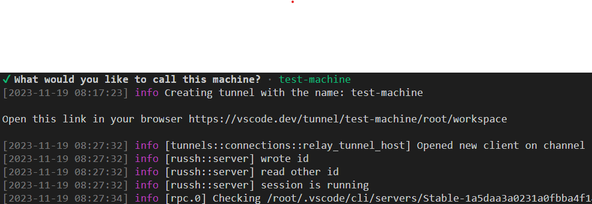
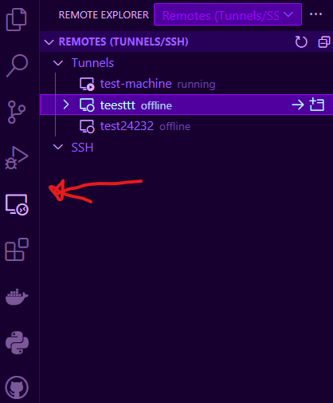
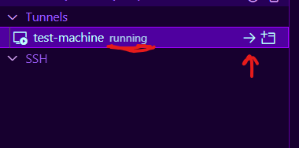

### Code Tunnel Uygulaması

Öncelikle, code server aracını indirmediyseniz indirin
```bash
curl -Lk 'https://code.visualstudio.com/sha/download?build=stable&os=cli-alpine-x64' --output vscode_cli.tar.gz

tar -xf vscode_cli.tar.gz
```
Ardından aracı çalıştırın:
```bash
./code tunnel
```
Ardından gelen seçenekte ***Github*** seçiyoruz.

Ardından size örnekte kırmızıyla çizdiğim yerde 8 haneli bir auth-key veriyor. Bu anahtarı paylaşmayın keza Github hesabınıza erişimi sağlıyor. 



Bu anahtarı   [bu linke](https://github.com/login/device) giderek çıkan ekrana yazın.


Ardından gelen ekranda hesabınıza erişim izni verin


Bu adımdan sonra, makinenize isim vermeniz gerekicek. Bu ismi Türkçe karakterler kullanmadan seçin. Sonradan bu isimi kullanıcaksınız.



Bu adımdan sonra 5-10 saniye beklemeniz gerekebilir. Kullanıma hazır olduğunda aşağıdaki gibi bir çıktı görüceksiniz terminalinizde:



Bu noktadan sonra isterseniz Microsoftun hostaldığı heryerden girebildiğiniz online ide'den, isterseniz yerelinizdeki VSCode uygulamasından uzak makinenize bağlanabilirsiniz. Burada önemli olan detay, hangisini kullanıyor olursanız olun ***Github hesabınızla giriş yapmanız gerekiyor***. Aynı zamanda uzaktan erişim yaptığınız web sayfasını kapatabilirsiniz. Ancak çalışan terminalde bir değişiklik yapmadığınıza dikkat edin.


Web arayüzüne https://vscode.dev/tunnel/***makine-ismi***/root/workspace
erişebilirsiniz

VSCode uygulamanıza [Remote Server](https://marketplace.visualstudio.com/items?itemName=ms-vscode.remote-server
) ve [Remote Explorer](https://marketplace.visualstudio.com/items?itemName=ms-vscode.remote-explorer) eklentilerini kurun.

Ardından soldaki buttonlardan remote-explorer a girin ve oradan tunnelinizi seçin.



Üstteki görsellerden çalışmayan makineleri ve çalışan makineleri görebilirsiniz. (Running ve offline yazılarından)

Bu şekilde bağlanmış oluyorsunuz. Artık siz de kendi VSCode ortamınızdan uzaktan erişmek istediğiniz makinelerinizde çalışabilirsiniz.

#### Bitirirken
Bu projeyi yapma amacın platformun Thelia idesine bağlılığından kurtulmasını sağlamaktı. Ve bu araçla bunu sağladım. Ideyi kaldırma nedenim ise aracın aşırı buglu olması, docker instancelerinin kaynaklarını gereksiz kullanmasıydı. Aynı zamanda kullanılcıların kendi ortamlarından platforma bağlanmasıyla kullanıcı deneyimini de arttırmayı hedefledim.

#### Sonraki Hedefler
- Kullanılan CLI uygulaması açık kaynaklıdır ve Rust dili ile yazılmıştır. Bu aracın kaynak kodunda platformun ihtiyaçlarına göre değişiklikler yaparak ve otomasyona uygun hale getirmek.
- VSCode'a bulut bilişimciler platformuna bağlanmayı kolaylaştıracak bir eklenti yazmak
