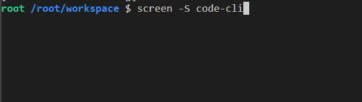
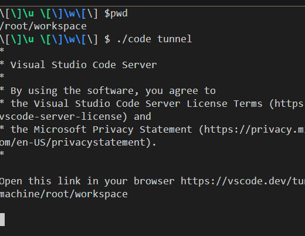
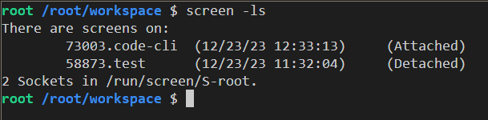

### Screen and Code CLI
Now i will show you usage of Screen with Code CLI

```bash
# We create a named session
screen -s code-cli
```

Then we run the program
```bash
./code tunnel
```

Since our tunnel is on the go, we can leave this session:
```bash
Ctrl A + D
```
We can look for our session with
```bash
screen -ls
```
